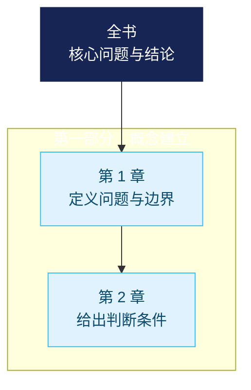

# 分析阅读工作流

## 1. 建立范围与类型

记录材料边界、可用定位和用户目标。先判断知识类、文学类或混合材料；范围不足时缩小结论，不能以常识补齐。

## 2. 映射整体

先画出章节、部分、叙事或概念的推进，再解释局部。知识类寻找问题、术语、主张与论证；文学类观察结构、叙述、人物、主题、意象与形式。

## 3. 有内容的层级摘要与思维导图

### 先做摘要，再画图

层级摘要是阅读重构的压缩结果，不是目录转写。按可访问材料的原有层级处理：全书/指定范围 → 部分（如有）→ 章 → 关键节。先为最小的实质节点写摘要，再将其压缩为上级节点；不得仅因为目录存在，就复制出一棵空标题树。片段或单章只能画该范围实际可见的层级，并明确未读范围。

对知识类节点，按下列信息写成 1--3 句自然语言：

1. **核心推进**：作者在此要回答什么，提出什么主张，或完成了什么论证动作。
2. **理解抓手**：只保留决定理解的机制、条件、证据类型、反例或限定；案例、修辞和重复仅在缺少它就会误解时保留。
3. **父子关系**：该节点怎样定义、支撑、细化、转折、应用或限制父节点。

对文学类节点，改写为叙事/主题推进：发生了什么变化，视角、人物、意象或形式如何推动上级主题；不强行改写成“主张—证据”。

标题只能置于摘要前作定位，不能成为摘要本身。用读者无需原书也能理解的白话改写术语或比喻；第一次出现的必要术语可在括号中解释。一般以关键节 25--60 字、章 40--100 字、部分 70--140 字、全书 100--220 字为压缩参考，而不是硬性配额：信息密度、可理解性和忠实性优先。

### 找“鱼骨”，而不是收集“鱼肉”

为每个节点先区分作者的核心推进（可概括为“鱼骨”）与支撑、案例、修辞、重复（“鱼肉”）。优先检查下列线索来**候选**核心句或核心段，再回到整节验证它们是否真的统摄内容：

- 节/章的开头和结尾；
- 转折、限定、结论和问题后的表达，例如“但是”“然而”“其实”“因此”“这意味着”；
- 定义句、反常识句、反复出现的表达，以及书籍装帧/序言与正文共同强调的内容。

这些都是线索而非证据规则。不能因为句子在开头或含转折词，就忽视限定条件、反论或后续修正；也不能把一个鲜活案例误写成全书主张。先写“作者说什么”，再在需要时补“如何支撑/为何重要”，不把 AI 的评价混进作者摘要。

### 摘要的可组合性与质量门槛

每个节点应可被上一级复用：将若干子节点的“核心推进”再次压缩，得到父节点，而不是另写一个泛泛主题。每个节点至少包含以下其中两项，且必须包含第一项：

| 必填信息 | 合格形态 | 不合格形态 |
|---|---|---|
| 作者推进 | “作者主张，先建立……，再以……限制该主张。” | “主张与限制” |
| 关键抓手 | “论证依靠定义与反例，而非单一案例。” | “举例说明” |
| 与上级关系 | “这一章把前文原则转成判断条件。” | “进一步讨论” |

输出前做三个检查：

1. **去标题测试**：遮住标题后，摘要仍能说明“说了什么、为何在这里说”。
2. **向上压缩测试**：父节点能由子节点推出；若不能，补足缺失的关系或改正层级。
3. **保真测试**：将摘要对回定位处，确认没有把案例当结论、把作者术语当已解释事实，或删掉改变结论的条件。

输出时采用“标题 + 内容摘要”的树，而不是只有标题的树。以下形态可直接复用；方括号里的定位和证据标签按实际材料替换：

```markdown
- **步骤三｜整合阅读** — [原文陈述，步骤三] 作者把“读懂”定义为能用自己的话压缩全书的核心思想，并要求先分开主张与用来支撑、吸引阅读的材料。
  - **摘要阅读法** — [原文陈述，2 节] 先定位能统摄一节的核心表达，再改写成外部读者也能懂的短句；这一操作把上一层的“辨认核心”落实为逐节方法。
```

### 与摘要同构的图形呈现

先给出富含信息的 Markdown 层级摘要；它是可引用的主载体。图形只负责帮助看清关系，不能承载唯一信息，也不能改写摘要的父子关系。

| 呈现方式 | 成本 | 适用情形 | 交付要求 |
|---|---|---|---|
| Markdown 树 | 最低 | 所有分析的保底、需要精确定位时 | 节点写完整摘要；保留定位与证据标签。 |
| Mermaid `flowchart` | 低 | 默认的全书鸟瞰、层级不超过三层 | 节点只写短标签/短结论，使用分组和一致色彩；完整内容留在 Markdown 树。 |
| Mermaid `mindmap` | 低 | 用户明确要传统脑图、节点很少时 | 仅用于方向感；不因布局好看而删去实质层级。 |
| 自包含 HTML 预览 | 中 | 用户明确要求“漂亮”“预览”“HTML”或需要展示/复用的图 | 生成单个离线可打开的 `.html`；提供文件链接和 Markdown 树回退。 |

默认图优先使用 Mermaid `flowchart TB` 或 `LR`，让每个图节点保持短而有意义（标题 + 8--18 字的结论性短语），用 `subgraph` 表示部分、`classDef` 表示层级或证据状态。不要把长段文字塞进节点，也不要把 3--5 字标题误当摘要。

可按下列骨架生成默认鸟瞰图；内容必须与上方 Markdown 树同构：



HTML 预览必须由同一份层级摘要数据生成，并做到：离线可用、移动端可读、颜色不作为唯一编码、各节点有短标签与可展开的摘要/定位、可折叠分支，并给出可复制的文本摘要。不得使用外部 CDN、未获授权的图片或把装饰性布局伪装成材料证据。用户未要求视觉成品时，不额外创建 HTML 文件。

## 4. 形成解释与证据账本

每个关键条目注明定位，并归入：

- `原文陈述`
- `AI 推断`
- `待核验问题`

把直接内容、结构归纳与未决问题分开。遇到混合材料，说明不同证据的地位。

## 5. 仅在请求时评议

完整重构之后，才按用户指定标准评议、反驳或核验。需要外部资料时先取得授权，并把外部证据单列。

## 最小输出骨架

1. 范围与类型
2. 整体地图
3. 知识类重构或文学类解读
4. 层级摘要与层级思维导图（有可见层级时）
5. 证据账本
6. 可选：评议
